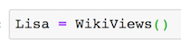
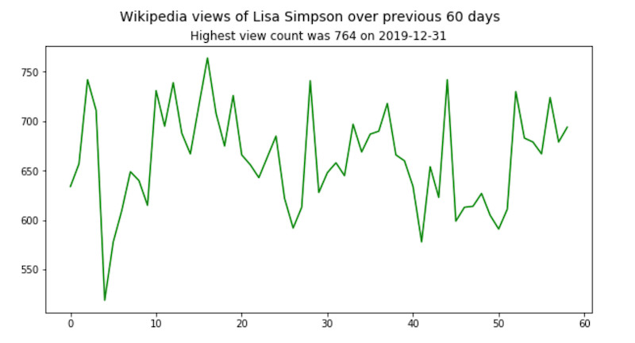
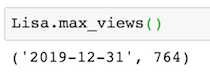
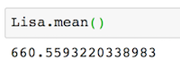
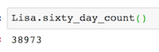
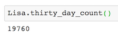
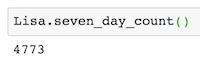
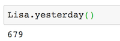
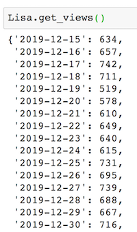
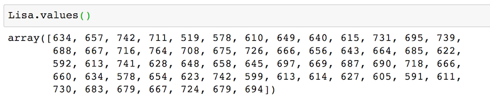

# Wiki-Views
With this Python script you can create a WikiViews object taking a person's name as the parameter that holds information about their Wikipedia page's views over the past 60 days. The data is pulled from Wikipedia's page view API.

## Object Instantiation
The default parameter is 'Lisa Simpson.' 

## Methods
`plot_two_months` returns a time-series plot of Wikipedia views over the previous 60 days.

`max_views` returns a tuple of the date of the maximum number of views and the number of views.

`mean` returns the mean daily views over the 60-day period.

`sixty_day_count` returns a total count of views over the previous 60 days.

`thirty_day_count` returns a total count of views over the previous month.

`seven_day_count` returns a total count of views over the previous week.

`yesterday` returns a count of views over the previous day.

`get_views` returns a dictionary with key, value of date, views for the previous 60 days. 

`values` returns an array of number of views per day over the previous 60 days.

